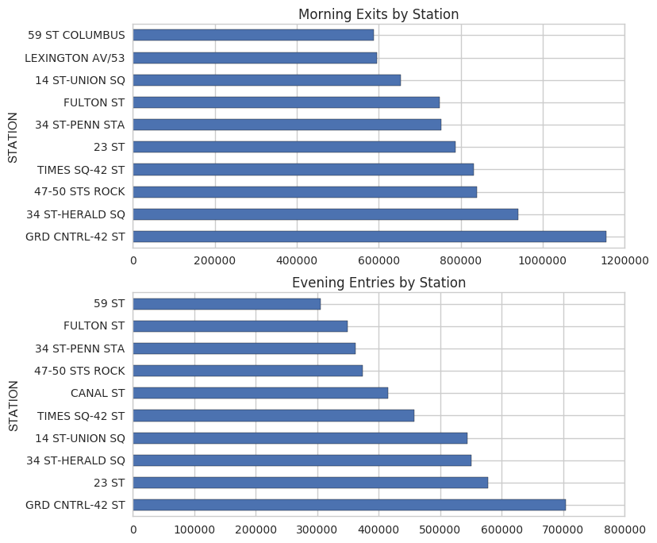
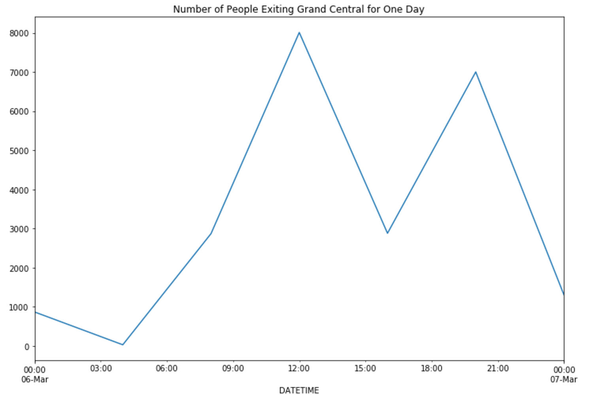

# Project 1: Benson 

### Team Members: Andrew, Emily, Florian, Paul

### Problem Statement

The target market are commuters who use the Metropolitan Transportation Authority (MTA) system since commuters are highly likely to purchase coffee in the mornings before work. In order to increase the user base, advertisements would be posted in high-traffic MTA stations. Users would then be sent push notifications from the app to prompt them to purchase drinks or renew drink subscriptions at a wide-range of partnered independent coffee shops in proximity to their current MTA stations.

### Analytical Approach

##### Criteria for Choosing MTA Commuter Stations
The publicly available MTA turnstile data from March 2017 was analyzed to determine the four stations that would garner the highest advertisement exposure to daily commuters. There were two criteria that were used to pinpoint these particular commuter stations:
1. High exit rate during the morning commute hours.
2. High entry rate during the afternoon and evening hours.

These two criteria would differentiate MTA stations with a high volume of commuter traffic from the other MTA stations. 

##### Data Analysis Approach
The data was grouped by station and by date and time. Since the data was audited in four hour intervals, the morning commute hours were determined to be between 4 AM and 12 PM. The afternoon and evening hours were determined to be between 4 PM and 8 PM. Four plots were created using the MTA turnstile data:
1. The data for the morning commute hours (**morning data**) and the data for the afternoon and evening hours (**evening data**) were totaled for the month of March in order to determine which stations had the highest amount of commuter traffic.
2. The data for the entire month of March was plotted to determine the weekly trend in the data to understand which days push notifications would be most efficient to send out. 
3. The data for one week within the month of March was plotted to determine if certain days of the week have more traffic than the other days.
4. The data for one day within the month of March was plotted to determine when the best time frame to deploy push notifications would be.

### Results

</img>

Figure 1 shows that stations with a high amount of exit traffic in the mornings also have a high amount of entry traffic in the afternoon and evening. These stations can be identified as commuter stations since they adhere to exit and entry rates characteristic of commuter traffic. 

</img>

Figure 2 illustrates that the stations with high morning exit traffic are near areas with a high density of coffee shops.

</img>

Figure 3 shows that exit traffic is significantly higher on weekdays compared with weekends. Traffic is pretty consistent across weekedays.

</img>

Figure 4 illustrates there is both a morning peak and an evening peak for weekday exit traffic in Grand Central station. This illustrates potential for market expansion through partnerships with nightlife businesses.

</img>

Figure 5 illustrates that the best time to send push notifications with coffee discounts is between 8 AM and and 12 PM.

### Analysis

Since the target market is commuters who are on their way to work in the mornings, the top ten stations with the highest morning exit are recommended as the locations to place advertisements.

These results are also in agreement with the independent study conducted by the MTA in 2015 ([link](http://web.mta.info/nyct/facts/ffsubway.htm)). The study found that the top three busiest stations in 2015 were Times Square–42nd Street, Grand Central–42nd Street, and 34th Street–Herald Square, which are all part of the recommended stations above. The results and the study also show that these stations are consistently busy week-by-week and year-by-year.

Assuming busy stations have similar traffic characteristics, Figure 3 illustrates that within the month of March, the optimal time to prompt users with push notifications is during the weekdays. Additional monthly snapshots and information regarding community events would give useful context regarding whether or not these stations should be the target stations.

From Figure 5, the most optimal time to send push notification would be between 8 AM and 12 PM. This is the time frame that most commuters are exiting the stations and are thus likely to purchase coffee to start their days.

### Conclusion

In conclusion, the optimal advertising strategy is to target the ten stations with the highest morning exit rates. The poster advertisements should be placed near the exits at these locations and push notifications should be sent out between 8 AM and 12 PM. Finally, we recommend that CUPS proactively partner with coffee shops in areas of high commuter density and low CUPS coverage.  

### Future Works

Since coffee is normally consumed in the morning, the app usage rate peaks during the morning hours and decreases as the day goes on. The MTA data can conversely be used to analyze which stations have the highest nightlife traffic. Restaurants and bars with happy hour discounts could be partnered with in order to promoste these small businesses as well as increase the CUPS app usage.

The analysis can also be further improved by expanding the analysis to include previous months as well as new incoming data. With additional data, we can explore seasonality and see how subway traffic varies over time to further target ads.

This analysis is also replicable across other transit systems with publicly available data, such as the Bay Area Rapid Transit (BART) system. This may prove to be a viable future project since the Client has partnerships within the San Francisco area
